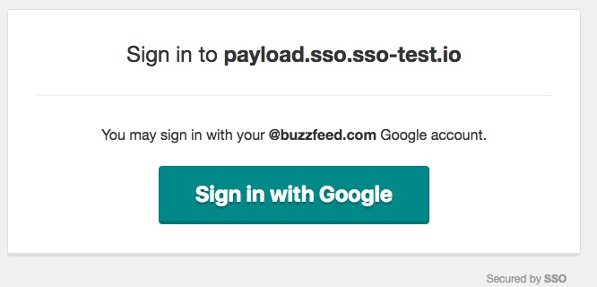
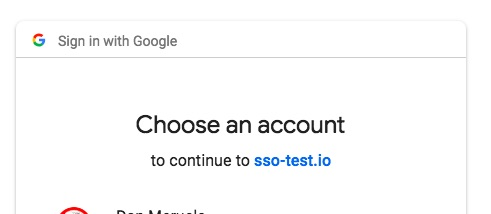

# Initial Setup / Operations

`sso` automates almost all of the provisioning necessary to deploy services, however, there are
a few one-time prerequisites that need to be handled manually.

**NOTE: all commands should be performed on your HOST OS.**

## Google Oauth Setup

Configuring `sso` requires that we first configure a Google OAuth Project.

#### Create a new Google Cloud project

Use a web browser to access the Google Cloud [Resource Manager](
https://console.developers.google.com/cloud-resource-manager). Log into your account, if you have
not already done so.

Select "Create Project". Provide the requested details (Project Name, etc), and click "Create". You
will have a notification when your project has finished being created; this should only take a
few moments.

#### Configure Google OAuth

Once your project has been created, click [here](
https://console.cloud.google.com/apis/credentials/consent) to configure the "Oauth consent screen"
for your project. Make sure that the name of the project you have created appears next to the words
"Google Cloud Platform" in the toolbar at the top of the website; if it does not, switch to your
project by clicking the name that appears there, and selecting the project you just created.

Fill in the field "Product name shown to users". We recommend the name `SSO Authenticator` for this
field. Hit "Save" after filling in this field.

After this, click [here](https://console.cloud.google.com/apis/credentials) to configure
credentials for the service. Click the button labeled "Create credentials", and select the option
"OAuth client ID".

The next screen will ask you to choose an "Application Type"; select "Web application". You will be
asked to fill in three fields.
- **Name**: Any appropriate name is fine (e.g. `Dev`).
- **Authorized JavaScript origins**: We recommend leaving this field blank.
- **Authorized redirect URIs**: Add the URI of your `sso-proxy` deployment, with the path suffix
`/oauth2/callback`. For example, if your `sso-proxy` will  be accessible at the domain
`sso.example.com`, then add the URI `https://sso.example.com/oauth2/callback`.

Once all of this has been entered, click the "Create" button. A dialog box will open with two
fields, a "client ID" and a "client secret". Copy both of these values to a safe and secure
location before clicking the "OK" button to proceed. The "client ID" and "client secret" strings
will be used to configure your `sso` deployment, as described below.

## Docker and Docker Compose Provisioning

Next, third party dependencies must be created and AWS resources provisioned:

 1. Setup Docker and Docker Compose on your machine
     Compose: https://docs.docker.com/compose/install/
     
 
 2. Configure SSO
 
 docker run buzzfeed/cop:fix-dockerfile ping -c 1 host.docker.internal | grep icmp_seq | awk '{print $4}' | cut -d':' -f1

## Run the container

Execute the containers by running the `run_sso_proxy.sh` script, and run a `docker ps` to see all four containers are up.

Open the payload via your browser with the address http://payload.sso.sso-test.io

Your browser will detect that you are not authenticated and re-direct you to the sso-auth at http://sso-auth.sso-test.io/sign_in?client_id=XXXX

Press the Sign In With Google button

sso-auth will detect that you are not logged in and re-direct your to a google-auth page at https://accounts.google.com/signin/oauth/oauthchooseaccount?client_id=

Choose the account you want to use that is authorized for with sso-proxy for this payload.
 
The google-auth will redirect you back to the desired payload page http://payload.sso.sso-test.io and you will now have access.

 
The `sso` CLI can then be used to perform _all_ operations, including deployment, service removal,
etc.

access via http://payload.sso.local/

[papertrail]: https://papertrailapp.com/
[datadog]: https://datadog.com
[Terraform]: https://www.terraform.io/
[Packer]: https://www.packer.io/
[sso_config]: /docs/sso_config.md
[how-do-i-even-gpg]: /docs/secrets.md#how-do-i-even-gpg
[secrets]: /docs/secrets.md#overview

